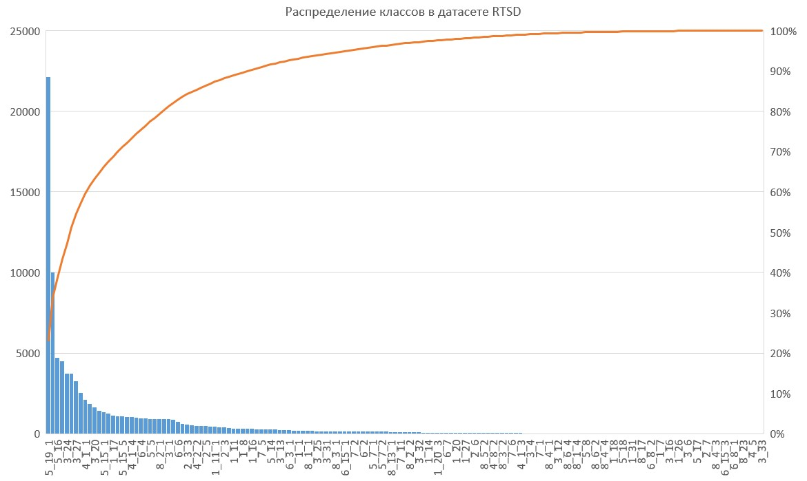
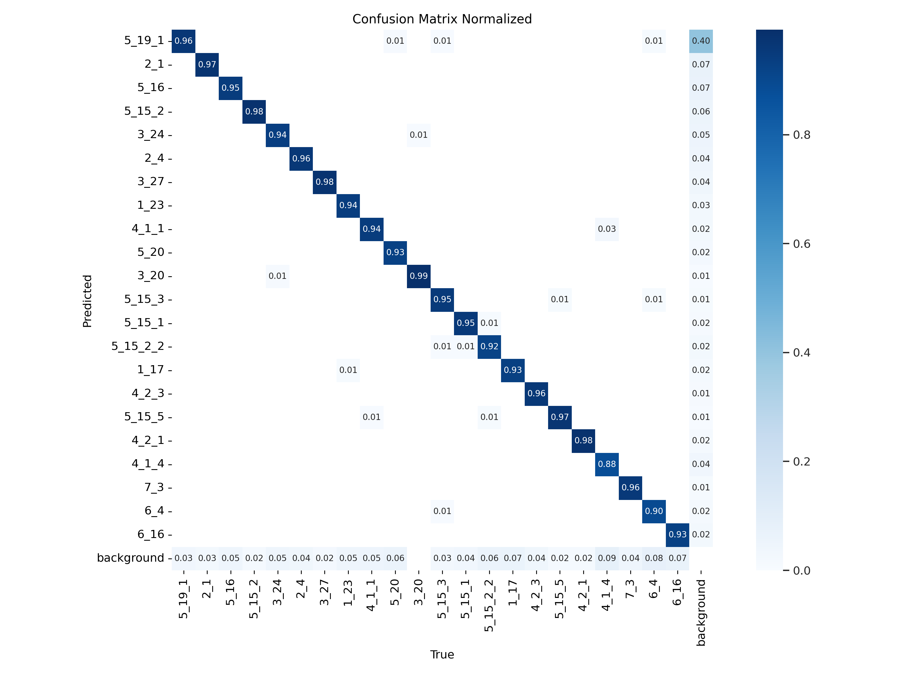
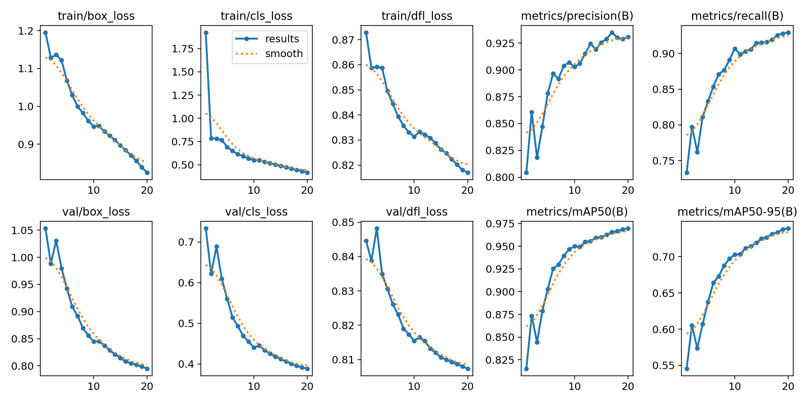
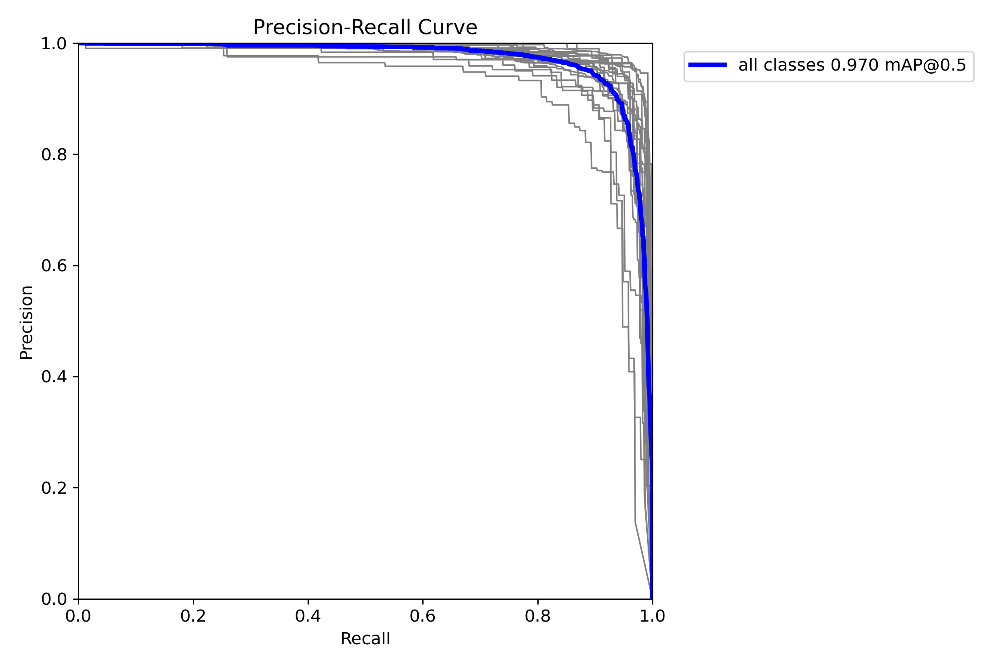
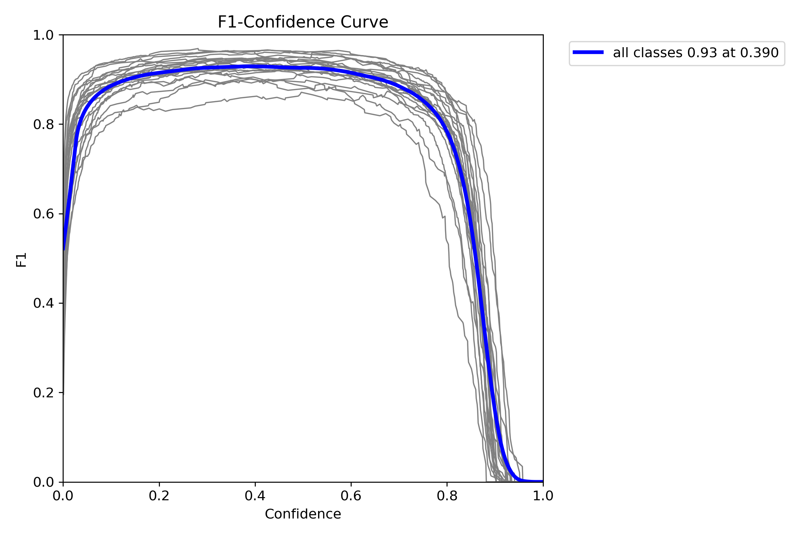
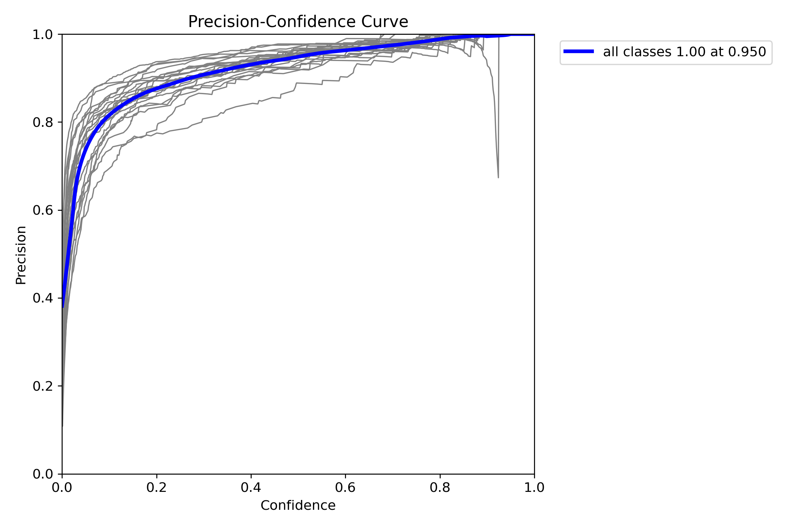

# Описание проекта

Прототип помощника для водителей, который будет оповещать их о дорожных знаках.

# Развернуть рабочее окружение

Проект использует `poetry` для управления зависимостями.
Устанавливаем `poetry` в нашу систему если он не установлен согласно офф. документации ([ссылка](https://python-poetry.org/docs/)).

Для создания виртуального рабочего окружения с `poetry` выполняем команду:
```
poetry install
```

Для его активации выполняем команду:
```
poetry shell
```

# Скачиваем датасет

Скачиваем датасет `Russian traffic sign images dataset (RSTD)` c `Kaggle` ([ссылка](https://www.kaggle.com/datasets/watchman/rtsd-dataset)).

# Преобразование данных

* разархивируем датасет и преобразуем его структуру под `FiftyOne's MS COCO ` формат (`RTSD_arhive_unzip.py`)
* преобразуем `train` и `val` подвыборки датасета `RSTD` с помощью `RTSD_dataset_COCO_to_CVAT_convert.py` из `MS COCO` -> `CVAT images`
* создаем файл `label.json` описания классов для `task` на разметку в `CVAT` (`convert_labels_to_CVAT_json.py`) для 
  1. `data/RSTD_cvat_train`
  2. `data/RSTD_cvat_val`
* архивируем папки с картинками (`images_folder_arhivier.py`) для 
  1. `data/RSTD_cvat_train`
  2. `data/RSTD_cvat_val`

# Загрузить данные в CVAT

Загрузим в `CVAT` `train`-подвыборку с помощью `cvat-cli` выполнив команду:
```
cvat-cli --auth USER --server-host IP-ADRESS --server-port 8080 create "RSTD_train" --labels data/RSTD_cvat_train/label.json --image_quality 100 --annotation_path data/RSTD_cvat_train/labels.xml --annotation_format "CVAT 1.1" local data/RSTD_cvat_train/data.zip
```
где 
* `USER` - логин администратора `CVAT`
* `IP-ADRESS` - ip-адрес сервера на котором располагается `CVAT`

для выполнения команды `CVAT` попросит нас ввести пароль администратора под логином которого мы выполняем данную команду.

Загрузим в `CVAT` `val`-подвыборку с помощью `cvat-cli` выполнив команду:
```
cvat-cli --auth USER --server-host IP-ADRESS --server-port 8080 create "RSTD_val" --labels data/RSTD_cvat_val/label.json --image_quality 100 --annotation_path data/RSTD_cvat_val/labels.xml --annotation_format "CVAT 1.1" local data/RSTD_cvat_val/data.zip
```
# Распределение классов в RTSD датасете

После этого средствами `CVAT` мы собрали статистику по встречаемости классов, оказалось что некоторых классов пренебрежимо мало.



Выбрали классы которые по количеству размеченных на них bbox составляли не менее 1% от всех bbox датасета.

Данные классы перечислены в `include_classes.txt`.

# Фильтрация классов по количеству представителей

* профильтруем датасет по классам, выполнив скрипт `RTSD_dataset_CVAT_filter_by_labels.py` для 
  1. `data/RSTD_cvat_train`
  2. `data/RSTD_cvat_val`

получим датасеты только с тем классами, которые мы решили оставить:
  1. `data/RTSD_train_cvat_filtered`
  2. `data/RTSD_val_cvat_filtered`

* создаем файл `label.json` описания классов для `task` на разметку в `CVAT` (`create_labels_for_CVAT_json.py`) для 
  1. `data/RTSD_train_cvat_filtered`
  2. `data/RTSD_val_cvat_filtered`

* архивируем папки с картинками (`images_folder_arhivier.py`) для 
  1. `data/RTSD_train_cvat_filtered`
  2. `data/RTSD_val_cvat_filtered`

# Загрузить данные с отобранными классами в CVAT

Загрузим в `CVAT` `train`-подвыборку с помощью `cvat-cli` выполнив команду:

```
cvat-cli --auth USER --server-host IP-ADRESS --server-port 8080 create "RSTD_train_filtered" --labels data/RTSD_train_cvat_filtered/labels.json --image_quality 100 --annotation_path data/RTSD_train_cvat_filtered/labels.xml --annotation_format "CVAT 1.1" local data/RTSD_train_cvat_filtered/data.zip
```
где 
* `USER` - логин администратора `CVAT`
* `IP-ADRESS` - ip-адрес сервера на котором располагается `CVAT`


Загрузим в `CVAT` `val`-подвыборку с помощью `cvat-cli` выполнив команду:
```
cvat-cli --auth USER --server-host IP-ADRESS --server-port 8080 create "RSTD_val_filtered" --labels data/RTSD_val_cvat_filtered/labels.json --image_quality 100 --annotation_path data/RTSD_val_cvat_filtered/labels.xml --annotation_format "CVAT 1.1" local data/RTSD_val_cvat_filtered/data.zip
```

# Преобразовать train и val подвыборки для обучения YOLOv8

Преобразуем датасеты с отобранными классами 
  1. `data/RTSD_train_cvat_filtered`
  2. `data/RTSD_val_cvat_filtered`

в формат датасета `YOLOv5` c помощью скрипта `RTSD_dataset_CVAT_to_YOLOv5_convert.py`.

В результате получим датасет `data/RSTD_filtered_yolov5` который будет содержать сразу `train` и `val` подвыборки.

# Скачаем датасеты с отобранными классами
download dataset
```
cvat-cli --auth USER --server-host IP-ADRESS  --server-port 8080 dump --format "COCO 1.0" --with-images True 117 RTSD_val_coco.zip
```

# Обучение модели

Для обучения модели запустим скрипт `yolov8_train.py`.

В результате была обучена модель на распознавание данных классов:

```
5_19_1
2_1
5_16
5_15_2
3_24
2_4
3_27
1_23
4_1_1
5_20
3_20
5_15_3
5_15_1
5_15_2_2
1_17
4_2_3
5_15_5
4_2_1
4_1_4
7_3
6_4
6_16
```

## Полученные метрики модели

* Сonfusion matrix normalized


* precision(B), recall(B), mAP50(B), mAP50-95(B), val/box_loss, val/cls_loss, val/dfl_loss


* Precision-Recall curve


* F1-confidence calibration curve


* Precision-confidence calibration curve


* Precision-confidence calibration curve


Скачать веса модели можно по данной ссылке ([ссылка](https://disk.yandex.ru/d/X7PqqG7LZUhI7Q)).