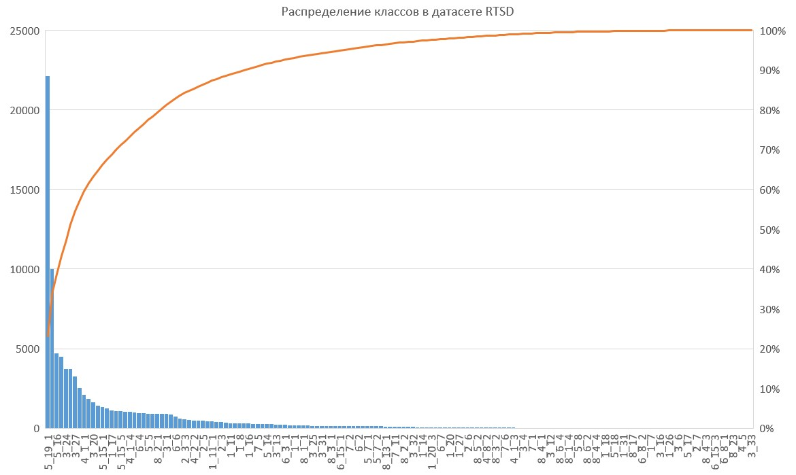
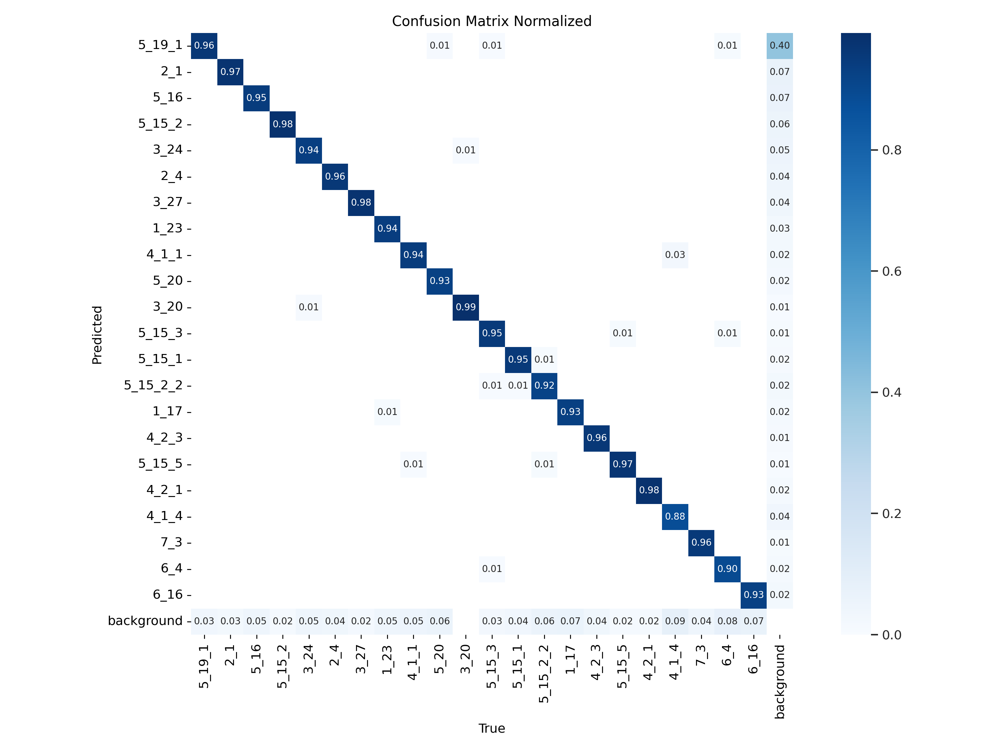
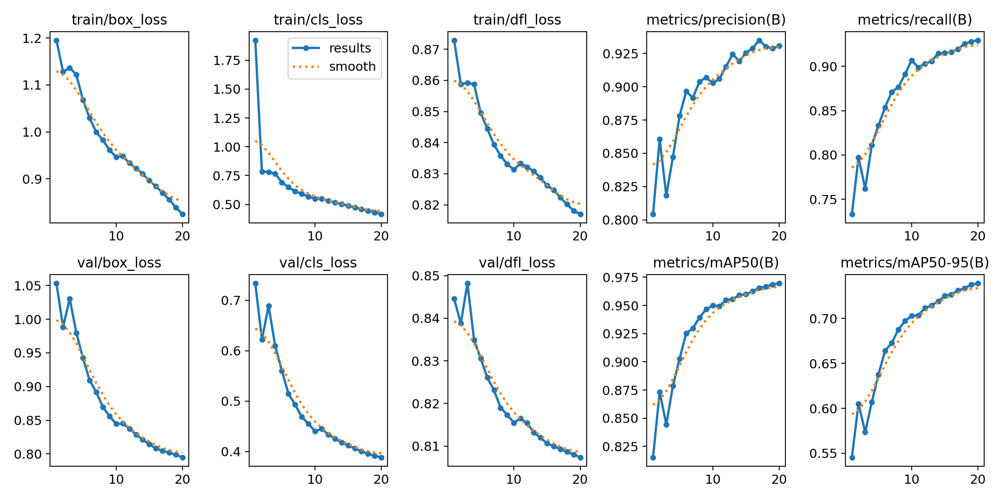
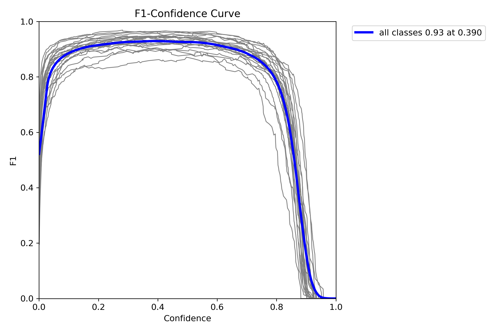
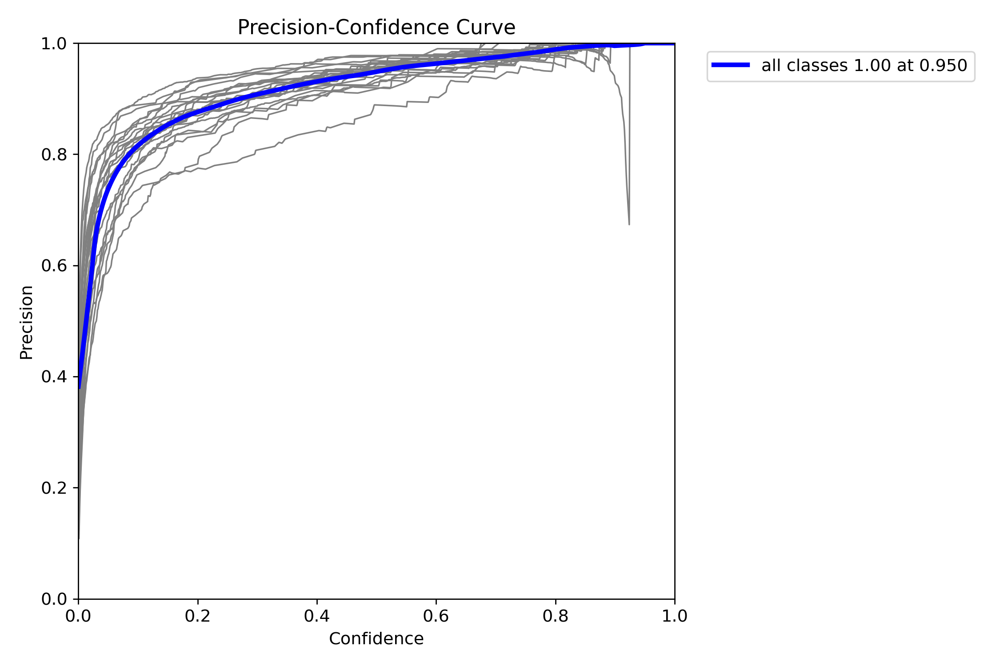
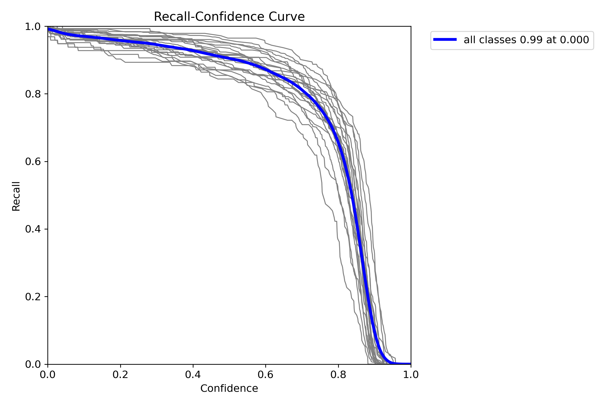

# Описание проекта

Прототип помощника для водителей, который будет оповещать их о дорожных знаках.

# Демо работы сервиса

Визуализация обнаружения дорожных знаков и уведомления для водителя


# Структура проекта

Структура проекта была создана под вдохновением от `Cookiecutter Data Science template` ([link](https://github.com/drivendata/cookiecutter-data-science)).

Исходная структура данного шаблона показалась нам перегруженной для небольшого проекта со сроком выполнения 2 недели.

Мы создали упрощенный вариант, который всегда может быть расширен, компонентами структуры исходного шаблона по мере необходимости и развития проекта.

Структура нашего проекта выгладит так

```
├── LICENSE            <- The MIT License (MIT).
├── README.md          <- Описание проекта README ля других разработчиков использующих проект.
├── data
│   ├── analysis       <- Данные используемые для анализа. Например, кропы с представителями классов дорожных знаков.
│   ├── external       <- Данные из других источников. Например, видео с YouTube для теста работы нашей модели.
│   ├── interim        <- Преобразованные датасеты для более удобного использования, но еще не в форме для обучения модели.
│   ├── processed      <- Финальная версия датасета используемая для обучения моделей.
│   └── raw            <- Датасеты в своей исходной форме.
│
├── models             <- Обученные и сериализованные модели и их метрики.
│
├── notebooks          <- Jupyter notebooks. Ноутбуки для исследования и анализа данных.
│
├── reports            <- Отчеты по анализу данных в виде Excel, HTML, PDF, LaTeX, etc.
│   └── figures        <- Графики и диаграммы в виде картинок используемые для отчетов или документации.
│
├── pyproject.toml     <- Мы используем poetry для создания виртуальной среды для разработки.
│
├── src                <- Source code используемый в данном проекте.
    │
    ├── data           <- Скрипты для обработки данных
    │
    ├── models         <- Скрипты для обучения моделей и упаковки их в архив для сохранения в облаке.
    │
    └── visualization  <- Скрипты для визуализации данных. Например, для визуализации кропов классов дорожных знаков.
```

# Развернуть рабочее окружение

Проект использует `poetry` для управления зависимостями.
Устанавливаем `poetry` в нашу систему если он не установлен согласно офф. документации ([ссылка](https://python-poetry.org/docs/)).

Для создания виртуального рабочего окружения с `poetry` выполняем команду:
```
poetry install
```

Для его активации выполняем команду:
```
poetry shell
```

# Скачиваем датасет

Скачиваем датасет `Russian traffic sign images dataset (RSTD)` c `Kaggle` ([ссылка](https://www.kaggle.com/datasets/watchman/rtsd-dataset)) для детекции дорожных знаков России.

Располагаем `archive.zip` датасета по пути `data/raw/archive.zip`.

https://www.kaggle.com/datasets/meowmeowmeowmeowmeow/gtsrb-german-traffic-sign/

# Преобразование данных

* разархивируем датасет и преобразуем его структуру под `FiftyOne's MS COCO ` формат (`src/data/RTSD_arhive_unzip.py`)
* преобразуем `train` и `val` подвыборки датасета `RSTD` с помощью `src/data/RTSD_dataset_COCO_to_CVAT_convert.py` из `MS COCO` -> `CVAT images`
* создаем файл `label.json` описания классов для `task` на разметку в `CVAT` (`src/data/convert_labels_to_CVAT_json.py`) для 
  1. `data/interim/RTSD_cvat_train`
  2. `data/interim/RTSD_cvat_val`
* архивируем папки с картинками (`src/data/images_folder_arhivier.py`) для 
  1. `data/interim/RTSD_cvat_train`
  2. `data/interim/RTSD_cvat_val`

# Загрузить данные в CVAT

Загрузим в `CVAT` `train`-подвыборку с помощью `cvat-cli` выполнив команду:
```
cvat-cli --auth USER --server-host IP-ADRESS --server-port 8080 create "RSTD_train" --labels data/interim/RTSD_cvat_train/label.json --image_quality 100 --annotation_path data/interim/RTSD_cvat_train/labels.xml --annotation_format "CVAT 1.1" local data/interim/RTSD_cvat_train/data.zip
```
где 
* `USER` - логин администратора `CVAT`
* `IP-ADRESS` - ip-адрес сервера на котором располагается `CVAT`

для выполнения команды `CVAT` попросит нас ввести пароль администратора под логином которого мы выполняем данную команду.

Загрузим в `CVAT` `val`-подвыборку с помощью `cvat-cli` выполнив команду:
```
cvat-cli --auth USER --server-host IP-ADRESS --server-port 8080 create "RSTD_val" --labels data/interim/RTSD_cvat_val/label.json --image_quality 100 --annotation_path data/interim/RTSD_cvat_val/labels.xml --annotation_format "CVAT 1.1" local data/interim/RTSD_cvat_val/data.zip
```
# Распределение классов в RTSD датасете

После этого средствами `CVAT` мы собрали статистику по встречаемости классов, оказалось, что некоторых классов пренебрежимо мало.



Выбрали классы которые по количеству размеченных на них bbox составляли не менее 1% от всех bbox датасета.

Данные классы перечислены в `include_classes.txt`.

# Фильтрация классов по количеству представителей

* профильтруем датасет по классам, выполнив скрипт `src/data/RTSD_dataset_CVAT_filter_by_labels.py` для 
  1. `data/interim/RTSD_cvat_train`
  2. `data/interim/RTSD_cvat_val`

получим датасеты только с тем классами, которые мы решили оставить:
  1. `data/processed/RTSD_train_cvat_filtered`
  2. `data/processed/RTSD_val_cvat_filtered`

* создаем файл `label.json` описания классов для `task` на разметку в `CVAT` (`src/data/create_labels_for_CVAT_json.py`) для 
  1. `data/processed/RTSD_train_cvat_filtered`
  2. `data/processed/RTSD_val_cvat_filtered`

* архивируем папки с картинками (`src/data/images_folder_arhivier.py`) для 
  1. `data/processed/RTSD_train_cvat_filtered`
  2. `data/processed/RTSD_val_cvat_filtered`

# Загрузить данные с отобранными классами в CVAT

Загрузим в `CVAT` `train`-подвыборку с помощью `cvat-cli` выполнив команду:

```
cvat-cli --auth USER --server-host IP-ADRESS --server-port 8080 create "RSTD_train_filtered" --labels data/processed/RTSD_train_cvat_filtered/labels.json --image_quality 100 --annotation_path data/processed/RTSD_train_cvat_filtered/labels.xml --annotation_format "CVAT 1.1" local data/processed/RTSD_train_cvat_filtered/data.zip
```
где 
* `USER` - логин администратора `CVAT`
* `IP-ADRESS` - ip-адрес сервера на котором располагается `CVAT`


Загрузим в `CVAT` `val`-подвыборку с помощью `cvat-cli` выполнив команду:
```
cvat-cli --auth USER --server-host IP-ADRESS --server-port 8080 create "RSTD_val_filtered" --labels data/processed/RTSD_val_cvat_filtered/labels.json --image_quality 100 --annotation_path data/processed/RTSD_val_cvat_filtered/labels.xml --annotation_format "CVAT 1.1" local data/processed/RTSD_val_cvat_filtered/data.zip
```

# Преобразовать train и val подвыборки для обучения YOLOv8

Преобразуем датасеты с отобранными классами
  1. `data/processed/RTSD_train_cvat_filtered`
  2. `data/processed/RTSD_val_cvat_filtered`

в формат датасета `YOLOv5` c помощью скрипта `src/data/RTSD_dataset_CVAT_to_YOLOv5_convert.py`.

В результате получим датасет `data/processed/RSTD_filtered_yolov5`, который будет содержать сразу `train` и `val` подвыборки.

# Скачаем датасеты с отобранными классами
download dataset
```
cvat-cli --auth USER --server-host IP-ADRESS  --server-port 8080 dump --format "COCO 1.0" --with-images True 117 RTSD_val_coco.zip
```

# Обучение модели

Для обучения модели запустим скрипт `src/models/yolov8_train.py`.

В результате была обучена модель на распознавание данных классов:

```
5.19.1 Пешеходный переход
2_1 Главная дорога
5_16 Автобусная остановка
3_24 Внимание, ограничение скорости
5_15_2 Обратите внимание на движение по полосам
2_4 Пожалуйста, уступите дорогу
3_27 Остановка запрещена
1_23 Осторожно, дети
4_1_1 Движение прямо
5_20 Внимание, Лежачий полицейский
3_20 Начало полосы
5_15_3 Однополосное движение переходитв двуполосное
5_15_1  Проверьте на какой полосе вы находитесь
5_15_2_2 Обратите внимание на полосу для поворота
1_17 Осторожно, возвышение на дороге
4_2_3 Объезд препятствия справа и слева
5_15_5 Конец полосы
4_2_1 Объезд препятствия справа
4_1_4 Движение прямо и направо
7_3 Автозаправка
6_4 Парковка
6_16 Остановитесь
```

Визуализация 20 кропов представителей каждого из классов


Визуализация получена последовательным применением скриптов

* для вырезания указанного количества кропов с представителями каждого класса `src/visualization/crop_bboxes_with_class_sample.py`
* для визуализации указанного количества кропов с представителями каждого класса `src/visualization/visualize_classes_samples.py`

на датасете для обучения `YOLOv8`.

## Полученные метрики модели

* Сonfusion matrix normalized


* precision(B), recall(B), mAP50(B), mAP50-95(B), val/box_loss, val/cls_loss, val/dfl_loss


* Precision-Recall curve


* F1-confidence calibration curve


* Precision-confidence calibration curve


* Precision-confidence calibration curve


Скачать веса модели можно по данной ссылке ([ссылка](https://disk.yandex.ru/d/X7PqqG7LZUhI7Q)).
Данный архив был получен скриптом `src/models/model_arhivier.py`.

## Таблица результатов

| epoch | train/box_loss | train/cls_loss | train/dfl_loss | metrics/precision(B) | metrics/recall(B) | metrics/mAP50(B) | metrics/mAP50-95(B) | val/box_loss | val/cls_loss | val/dfl_loss | lr/pg0    | lr/pg1    | lr/pg2    |
| ----- | -------------- | -------------- | -------------- | -------------------- | ----------------- | ---------------- | ------------------- | ------------ | ------------ | ------------ | --------- | --------- | --------- |
| 1     | 1.1951         | 1.924          | 0.87289        | 0.8043               | 0.73304           | 0.81532          | 0.54547             | 1.0532       | 0.73359      | 0.84458      | 0.003331  | 0.003331  | 0.003331  |
| 2     | 1.1279         | 0.78341        | 0.85876        | 0.86066              | 0.79731           | 0.87331          | 0.60527             | 0.98853      | 0.6219       | 0.83879      | 0.0063344 | 0.0063344 | 0.0063344 |
| 3     | 1.1366         | 0.78185        | 0.85923        | 0.81829              | 0.76181           | 0.8445           | 0.57339             | 1.0305       | 0.68911      | 0.8482       | 0.0090079 | 0.0090079 | 0.0090079 |
| 4     | 1.1216         | 0.76634        | 0.85871        | 0.84733              | 0.8112            | 0.87869          | 0.60698             | 0.97985      | 0.60946      | 0.83493      | 0.008515  | 0.008515  | 0.008515  |
| 5     | 1.068          | 0.69116        | 0.84955        | 0.87803              | 0.83308           | 0.90284          | 0.63765             | 0.9425       | 0.56029      | 0.83056      | 0.008515  | 0.008515  | 0.008515  |
| 6     | 1.0294         | 0.64936        | 0.8444         | 0.89646              | 0.85373           | 0.92533          | 0.66401             | 0.90926      | 0.51441      | 0.82605      | 0.00802   | 0.00802   | 0.00802   |
| 7     | 0.99954        | 0.61327        | 0.83935        | 0.89169              | 0.87098           | 0.9297           | 0.67282             | 0.89183      | 0.49306      | 0.82314      | 0.007525  | 0.007525  | 0.007525  |
| 8     | 0.98244        | 0.5922         | 0.83575        | 0.90387              | 0.87649           | 0.93931          | 0.68753             | 0.86974      | 0.46874      | 0.819        | 0.00703   | 0.00703   | 0.00703   |
| 9     | 0.96148        | 0.56786        | 0.83308        | 0.9069               | 0.89098           | 0.94655          | 0.69725             | 0.85612      | 0.45487      | 0.81734      | 0.006535  | 0.006535  | 0.006535  |
| 10    | 0.94665        | 0.55006        | 0.83134        | 0.90275              | 0.90689           | 0.94994          | 0.70286             | 0.84456      | 0.44035      | 0.81547      | 0.00604   | 0.00604   | 0.00604   |
| 11    | 0.94842        | 0.54839        | 0.83332        | 0.90591              | 0.89889           | 0.94919          | 0.70349             | 0.84516      | 0.44487      | 0.81651      | 0.005545  | 0.005545  | 0.005545  |
| 12    | 0.93366        | 0.53215        | 0.83213        | 0.91506              | 0.90287           | 0.95492          | 0.71157             | 0.83771      | 0.43374      | 0.81543      | 0.00505   | 0.00505   | 0.00505   |
| 13    | 0.92272        | 0.5177         | 0.83084        | 0.92451              | 0.90575           | 0.9556           | 0.71452             | 0.82874      | 0.42542      | 0.81316      | 0.004555  | 0.004555  | 0.004555  |
| 14    | 0.91073        | 0.50286        | 0.82878        | 0.91906              | 0.91454           | 0.95912          | 0.71901             | 0.82135      | 0.41793      | 0.81197      | 0.00406   | 0.00406   | 0.00406   |
| 15    | 0.89642        | 0.48861        | 0.8262         | 0.9254               | 0.91502           | 0.95992          | 0.7252              | 0.81437      | 0.41211      | 0.81062      | 0.003565  | 0.003565  | 0.003565  |
| 16    | 0.88399        | 0.47459        | 0.82475        | 0.92878              | 0.91588           | 0.96247          | 0.72677             | 0.8081       | 0.40607      | 0.80999      | 0.00307   | 0.00307   | 0.00307   |
| 17    | 0.87013        | 0.45941        | 0.82238        | 0.93486              | 0.91953           | 0.96567          | 0.73125             | 0.80485      | 0.40044      | 0.80924      | 0.002575  | 0.002575  | 0.002575  |
| 18    | 0.85588        | 0.44461        | 0.82019        | 0.93013              | 0.9254            | 0.96666          | 0.73371             | 0.80207      | 0.39526      | 0.80865      | 0.00208   | 0.00208   | 0.00208   |
| 19    | 0.83945        | 0.42945        | 0.81814        | 0.9287               | 0.92807           | 0.96861          | 0.73764             | 0.79885      | 0.39125      | 0.80803      | 0.001585  | 0.001585  | 0.001585  |
| 20    | 0.8248         | 0.41468        | 0.81698        | 0.93057              | 0.92947           | 0.96961          | 0.73911             | 0.79494      | 0.38833      | 0.80735      | 0.00109   | 0.00109   | 0.00109   |

# Эксперименты с оптимизацией модели

Были протестированы следующие подходы для оптимизации производительности модели:

* PyTorch fuse - запуск PyTorch модели с layer fusion
* ONNX - экспорт модели в ONNX
* ONNX Simplify - экспорт модели в ONNX с последующей оптимизацией графа нейросети
* ONNX Simplify half - экспорт модели в ONNX с последующей оптимизацией графа нейросети и квантизацией до `float16`
* OpenVino - экспорт модели в OpenVino
* OpenVino half - экспорт модели в OpenVino c квантизацией до `float16`

Анализ произведен в `notebooks/yolov8s_detect_export.ipynb`.

Результаты приведены для val части `Russian traffic sign images dataset (RSTD)` c `Kaggle` ([ссылка](https://www.kaggle.com/datasets/watchman/rtsd-dataset)) для детекции дорожных знаков России с сохранением 22 самых популярных классов дорожных знаков.

Все тесты производились на CPU `12th Gen Intel(R) Core(TM) i5-12600`.

| Device-CPU          | preprocess ms | inference ms | loss ms | postprocess ms | mask map50-95 | mask map50 | mask map75 | size Mb|
|---------------------|---------------|--------------|---------|----------------|---------------|------------|------------|--------|
| PyTorch fuse        | 0.1           | 37.0         | 0       | 0.3            | 0.742         | 0.97       | 0.893      | 21.5   |
| ONNX                | 0.4           | 62.0         | 0       | 1.8            | 0.738         | 0.967      | 0.888      | 42.7   |
| ONNX Simplify       | 0.3           | 66.8         | 0       | 0.8            | 0.738         | 0.967      | 0.888      | 42.6   |
| ONNX Simplify half  | 0.4           | 62.7         | 0       | 0.9            | 0.738         | 0.967      | 0.888      | 42.6   |
| OpenVino            | 0.3           | 45.1         | 0       | 0.4            | 0.738         | 0.967      | 0.888      | 42.8   |
| OpenVino half       | 0.3           | 44.7         | 0       | 0.4            | 0.738         | 0.967      | 0.888      | 21.6   |

По результатам тестов видно, что самой быстрой моделью является `PyTorch fuse`.

Данная модель так же сохраняет потенциал к дальнейшей оптимизации с квантизацией до `float16`.

Использование `Automatic Mixed Precision (AMP)` обеспечивает небольшое снижение точности.

Квантизация в `float16` для `ONNX` и `OpenVino` пока не работает в `ultralytics=="8.0.209"`.

# Инференс класс для обученных нейронных сетей

Инференс класс представлен в `src/models/YOLOv8_Detector_Inference.py`.

Благодаря его методу `predict_on_video_and_viz` были сгенерированы демо видео сервиса помощника для водителя.